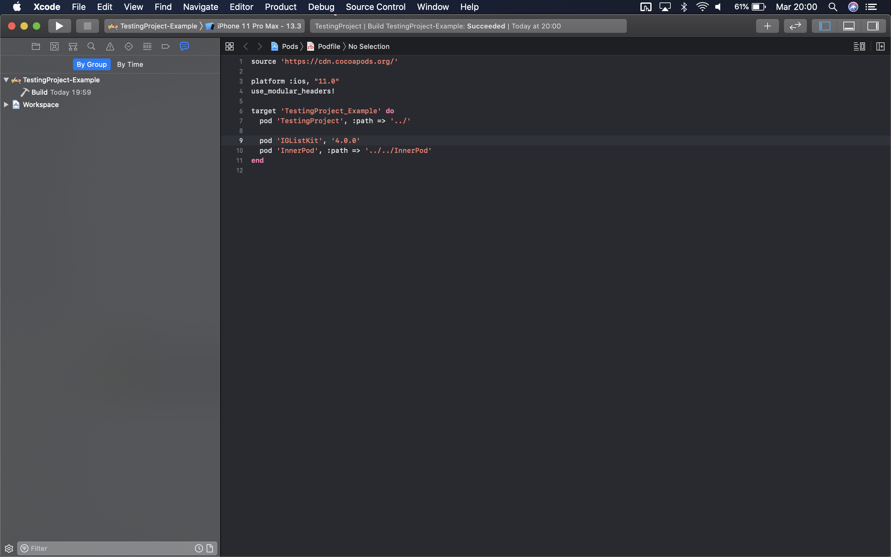
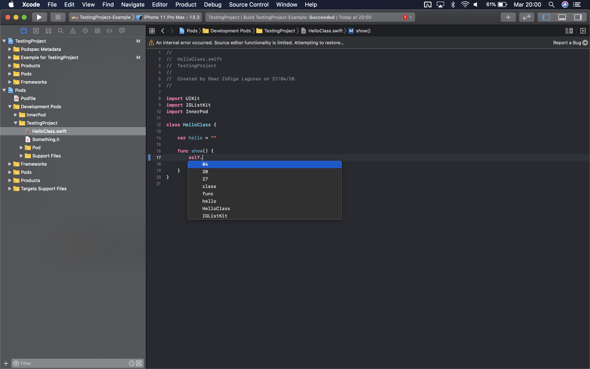
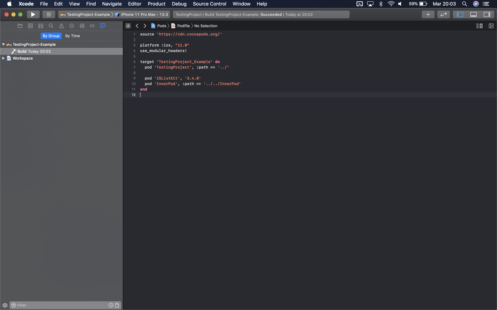
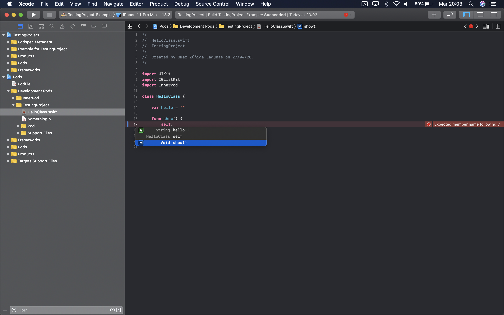
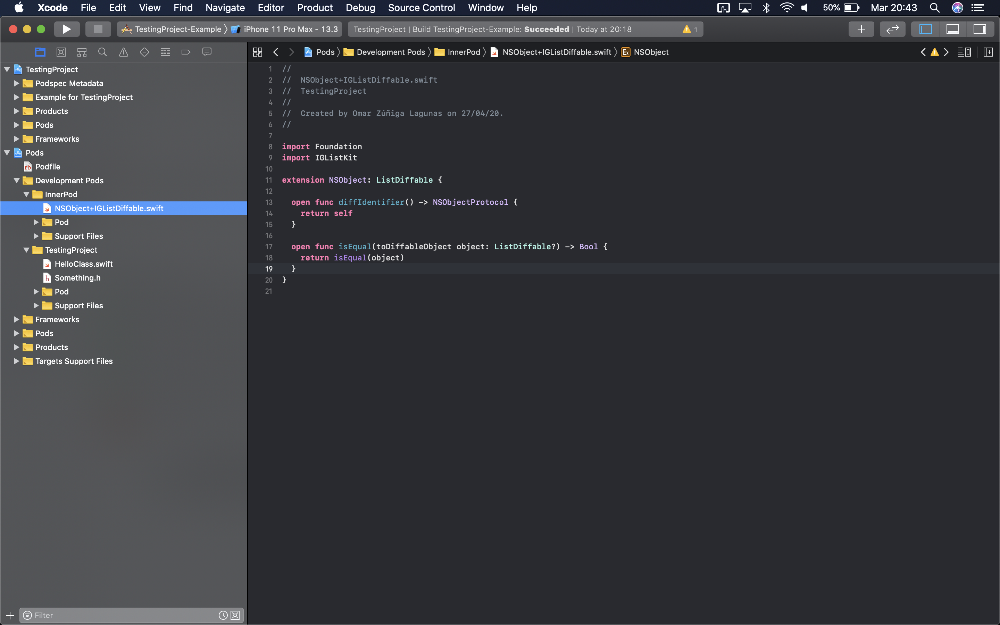
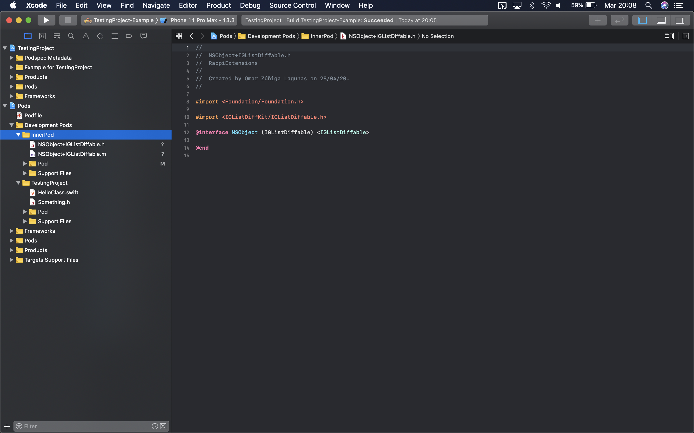
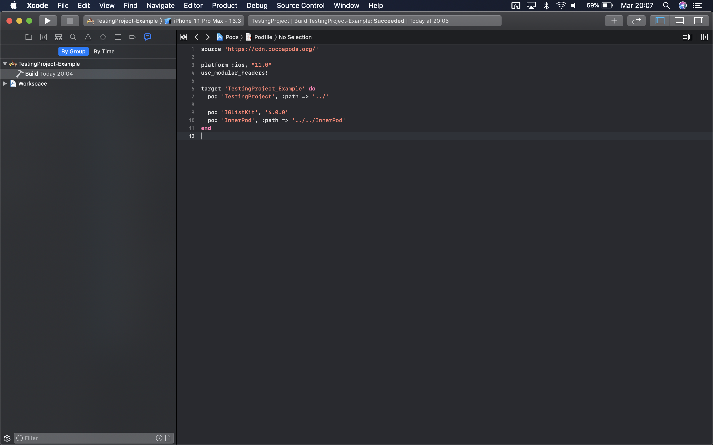
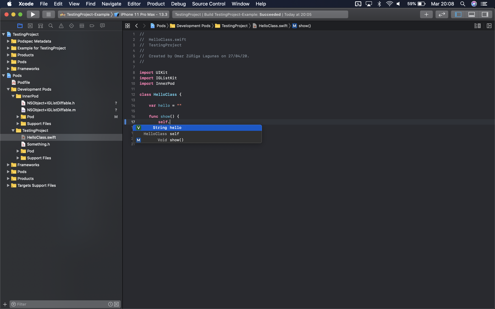

# Source Editor Crash with IGListKit 4.0.0

Project that demonstrates a source editor crash that disables the autocomplete and living issues functionality when
we migrated an app to IGListKit 4.0.0

This demo was builded using:

macOS Catalina 10.15.1

Xcode 11.3.1

Cocoapods 1.9.1

------

The demostration of this error is in the `master` branch.

It consists in a working workspace in the path: `TestingProject/Example/TestingProject.xcworkspace`

It uses cocoapods as dependency manager and it is important to say that it compiles the dependencies as static frameworks
using the line: `use_modular_headers!` in the `Podfile`

It has a dependency to the pod `TestingProject`, the podspec can be found in the path: `TestingProject/TestingProject.podspec` and
the source code in the path: `TestingProject/TestingProject/Classes`, it is important to say the this pod has code in swift
and in objective-c, for testing pourpose here I only added a header file (`Something.h`)

The pod `TestingProject` has itself a dependency to the pod `InnerPod`, the podspec can be found in
the path: `InnerPod/InnerPod.podspec` and the source code in the path: `InnerPod/Source`

When you build the project it compiles without any error:

But if you try to autocomplete a function SourceKit crashes and Xcode shows the error "An internal error ocurred. Source editor functionalty is limited. Attemping to restore..."

------

Branch: downgrade

After a lot investigation I found that IGListKit was causing this, so I downgraded to version 3.4.0 and in that version there is no issue

It compiles correctly:

And it autocompletes correctly:

------

Branch: solution

I made a lot of tests, and it seems that this error was only affecting us with specific conditions, it is the sum of static libraries + an NSObject extension (file: NSObject+IGListDiffable.swift) + IGListKit 4.0.0

I want the advantages of IGListKit 4.0.0 and leaving out static libraries is not an option for us so I took many time to found out another way to solve it, I finally found that this extension was interfering somehow, and I changed the code from swift to objective-c and it solved the issue.

Original file:

New objective-c files:

It compiles:

And it autocompletes:

